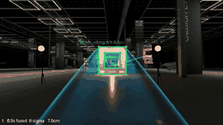
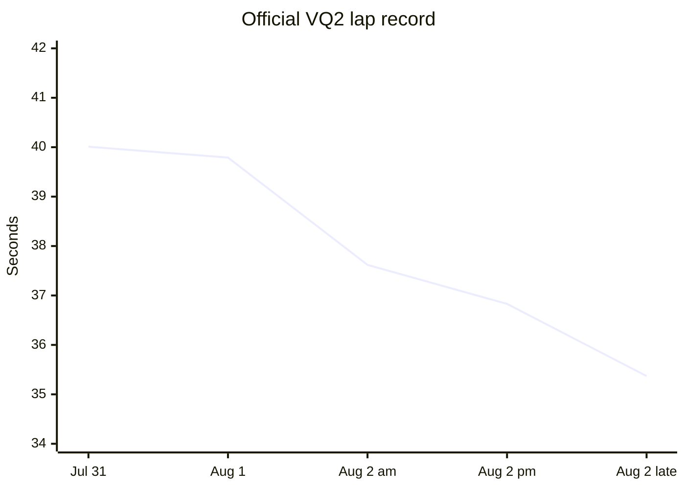
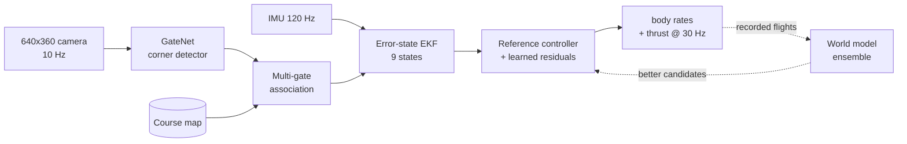
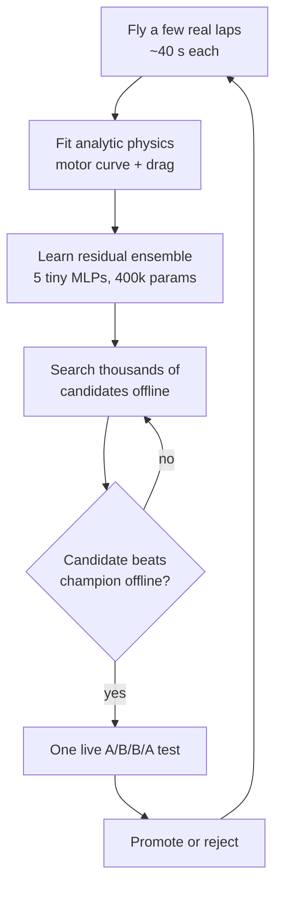
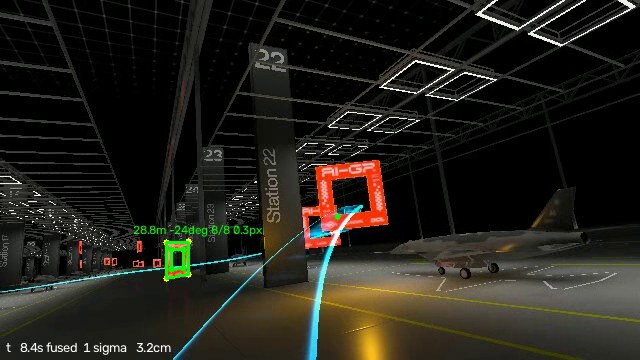
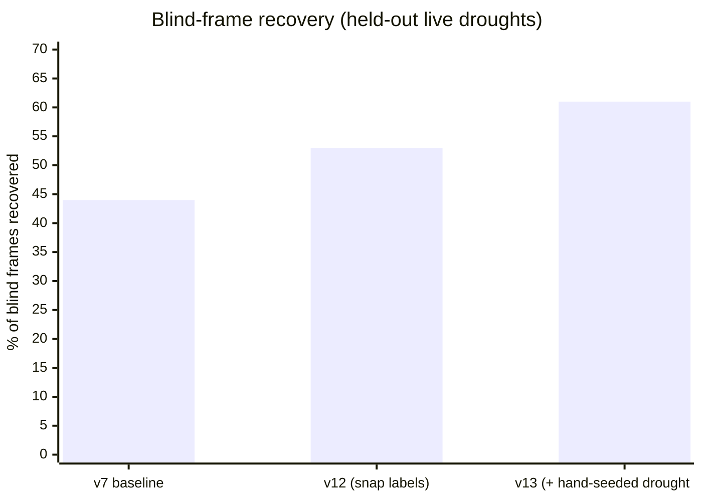
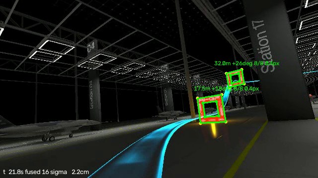
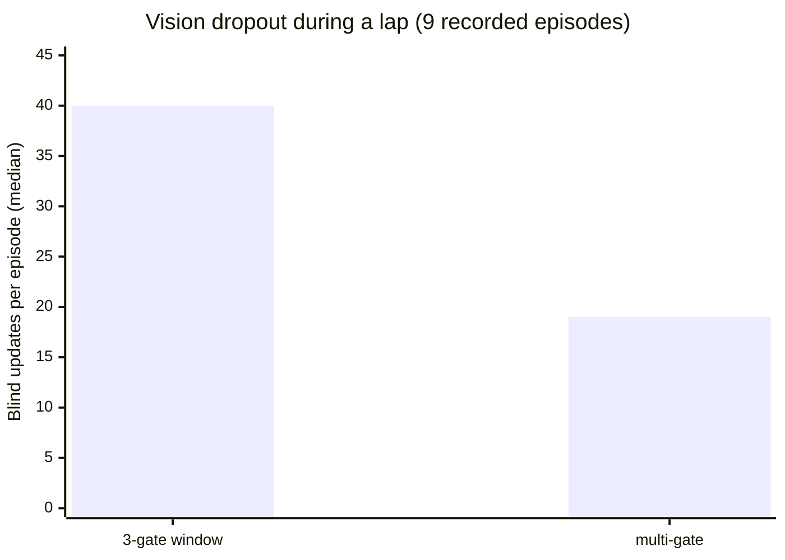
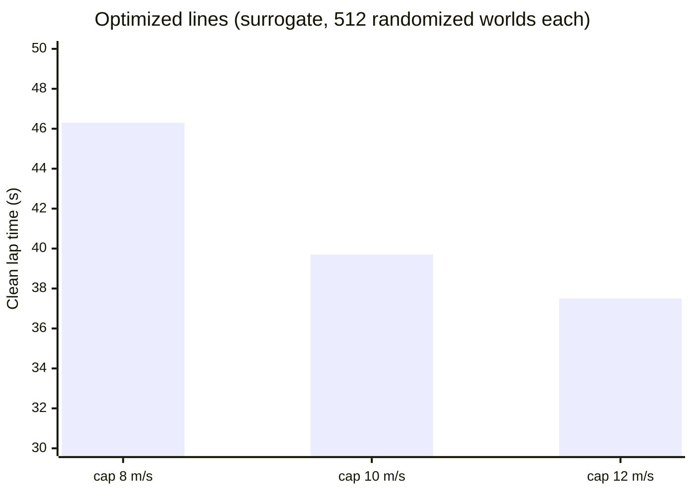

# redemption — an autonomous drone racing stack

Camera + IMU only. No GPS, no odometry, no cheating the estimator. Our drone
finds the gates, figures out where it is, and races.

Built for the **AI Grand Prix** (Anduril × DCL) on the VQ2 Arsenal course:
17 gates, ~200 m of hairpins, chicanes and straights.

**Official record on the course: 35.374649 s.**



*A complete lap from the drone's own camera, sped up ~7x. Green boxes are gates
the localizer has locked; the labels show range, bearing, corners matched, and
pixel residual. Bottom-left ticks along with elapsed time, corners fused, and
the filter's position uncertainty.*

---

## How the lap time fell



| Milestone | Time | What changed |
|---|---:|---|
| First full course | 40.01 s | Reference controller finishes 17/17 |
| 39.79 s | −0.2 s | Corrected map (gate 9 was off by 0.47 m) |
| 37.62 s | −2.2 s | Multi-gate localization + surrogate-optimized racing line |
| 36.83 s | −0.8 s | Gate-routed residual policies |
| **35.37 s** | **−1.5 s** | Optimized late-course suffix, speed-tuned |

---

## The stack in one picture



Everything on the left of the drone runs **live at 30 Hz on a laptop**.
Everything on the right runs offline, learning from what actually happened.

---

## The world model: our answer to having no compute

We had **one shared RTX 5090** (borrowed, in use by other people half the
time) and a **laptop RTX 5070 Ti that also had to run the simulator**. Flying
one live test lap costs ~40 seconds of wall clock. Training a policy the
normal way — millions of live environment steps — was never on the table.

So we inverted the problem: **learn a model of the simulator, then do the
searching inside the model.**



**The model is deliberately tiny — 1.6 MB.** It does *not* replace physics.
The analytic surrogate (measured motor curve `14.05u + 64.86u²`, measured
drag) integrates every step; the network only predicts small corrections to
velocity, attitude and body rates. Position stays a pure integration so the
network can never launder estimator jumps into fake acceleration.

Three tricks that made it trustworthy:

- **Ensemble disagreement, not ensemble mean.** Each simulated world gets one
  of the five members, so a candidate has to work across model *disagreement*
  instead of exploiting the average model's blind spots.
- **Failures are training data.** Every live crash becomes a counterexample.
  The model that predicted "this will work" gets corrected by the run where it
  didn't — recovery on held-out failures went from 0.574 m → 0.279 m error.
- **Honest audits.** Fresh random seeds, paired worlds, and a rule that no
  candidate flies without beating the champion offline first.

Result: ~**300,000 simulated steps per second** on one GPU, and a full
candidate search in ~10 minutes instead of a week of live flying.

---

## Vision: hundreds of hand-labeled frames

GateNet predicts 8 gate-corner heatmaps at 640×360. Corners → PnP → EKF.

The hard part isn't the network, it's the labels. **Henry hand-clicked
hundreds of frames** — the awkward ones the auto-labeler could never produce:
gates half out of frame, gates 2 m away filling the whole image, gates behind
a parked jet. Those clicks seeded a pipeline that grew to **39,443 labeled
frames**, and they're the reason the detector works at the moments that decide
a race.



*The gate-1 approach: a pillar and a parked jet sit right on the racing line,
and the next gate is still 28.8 m out — detected 8/8 corners at 0.3 px. This
is the view that used to blind the detector.*



The lesson we paid for: a detector trained only on what it can *already*
almost see just rebuilds its own blind spot. Labeling the frames where it
failed — by hand — was what broke the loop.

**Measured, on replays of real racing:**

| Metric | Result |
|---|---|
| Corner localization | 0.73 px median (full flight envelope) |
| Gate-relative pose in motion | **1.4 cm / 0.8°** at 0–5 m |
| Absolute pose, two gates in view | ~3 cm / ~0.07° |
| Dense inference | 28 ms GPU (was 220 ms on CPU) |

---

## Multi-gate localization

Originally the localizer only looked at three gates: previous, active, next.
Every gate looks identical, so associating a corner with the *wrong* gate can
teleport the estimate by meters.

We made it look at **every visible gate at once**, safely:

1. Project all 17 gates through the current estimate, cull the impossible ones.
2. Assign detected corners to gate corners with a **global one-to-one matching**
   — no image corner can ever serve two gates.
3. Accept a gate only with enough exclusive corners (more required at range).
4. Solve all accepted gates jointly in one filter update.



*Two gates held simultaneously — 8/8 corners each at 0.4 px, 16 corners fused
into one filter update, position uncertainty 2.2 cm. A single gate can't do
this.*



**The surprise:** vision had always been forbidden from correcting *attitude*,
because a single flat gate can't tell tilt from translation and once corrupted
the whole estimate. With two well-separated gates the ambiguity disappears —
and it turned out attitude correction isn't just safe, it's **required**. Refuse
it, and the error gets squeezed into position until an association slips
(we measured 1.8 m and 21 m divergences before figuring this out).

---

## The racing line

The drone was imitating human laps — including the parts where the human flew
*carefully*. So we searched for a better line offline: where exactly to cross
each gate, and how fast to take each segment.



Crossing points are bounded so the *planned* line always keeps a safety margin
from the gate edge; candidates are scored by finish rate first, lap time
second, under the full measured noise stack — vision blackouts, estimator
jumps, control lag, motor variation.

A late discovery worth the whole exercise: at the gate 12→14 reversal the
camera can never hold two gates at once, so localization collapses to a single
landmark exactly where the drone is turning hardest. That corner is
**perception-limited, not thrust-limited** — no amount of extra speed helps
until the geometry changes.

---

## Efficiency, because everything was fighting for the same GPU

The simulator, the vision network, and the control loop all shared one laptop
GPU. If we lagged the sim, the drone flew badly and we couldn't tell whether
our change was bad or the machine was tired.

What we did about it:

- **Dense vision moved to GPU with a hard 10 Hz budget** — 28 ms/frame,
  pinned CPU cores for the control thread so vision can never starve it.
- **Batched everything offline.** Candidate searches evaluate the *whole
  population* in one 8,192-environment batch — 43 s per generation instead of
  13 minutes.
- **Session-health telemetry on every flight.** We measured that the sim
  degrades with uptime (frame hitches 63 ms → 272 ms across a night), so runs
  now auto-abort as *infrastructure faults* instead of being blamed on the
  policy. Late-session results systematically under-measure — that one insight
  saved us from chasing several phantom regressions.

---

## How we avoid fooling ourselves

Racing results are noisy, and it is very easy to promote luck. The rules we
converged on, all of them learned the hard way:

- **Champion is protected.** A challenger replaces it only after a full
  interleaved champion/challenger comparison, a locked regression set, and no
  new failure concentration — never on one fast lap.
- **A/B/B/A flights.** Champion and candidate alternate in the same session, so
  simulator health can't masquerade as a result.
- **Everything is hashed.** Config, demo, episode, artifacts — the 35.37 s run
  is reproducible from a manifest of 9,276 files.
- **The offline evaluator must match the real controller exactly.** We built a
  three-layer parity oracle for this: action-for-action against a recorded lap,
  action-for-action through full noisy rollouts, then paired 768-world
  statistics. It caught four separate bugs where our search was quietly
  optimizing for a controller that doesn't exist.

---

## Layout

```
aigp/
  vq2_live_localizer.py   camera → corners → association → EKF (live)
  vq2_multigate.py        course-wide gate association
  ekf.py                  9-state error-state filter
  vision/                 GateNet + labeling
  fastsim/                surrogate sim, world model, batched controllers
  rl/                     live environment + SAC/PPO pieces
scripts/                  training, searches, audits, flight harnesses
data/                     maps, models, demos, optimized lines
```

---

## More footage

The animation above is `vq2_HOP_cleanlap.mp4` compressed to a GIF. Full-quality
recordings are kept outside the repo (~50 MB each) and all carry the same live
overlay: detected corners, per-gate range and bearing, pixel residual, and the
filter's own uncertainty.

| Recording | What it shows |
|---|---|
| `vq2_HOP_cleanlap.mp4` | Full lap, localizer overlay |
| `vq2_g9fix_proof.mp4` | Map correction: old (red) vs fixed (green) projections |
| `vq2_NO_CONTACT_*.mp4` | Clean no-contact runs across detector variants |

---

## Running it

### Setup

Requires the AI-GP simulator, Python 3.12, and an NVIDIA GPU (the live stack
runs dense vision on CUDA at 10 Hz; CPU-only works but drops to ~3 Hz and the
drone flies noticeably worse).

```powershell
py -3.12 -m venv .venv-train
.\.venv-train\Scripts\python.exe -m pip install -U pip
.\.venv-train\Scripts\python.exe -m pip install torch --index-url https://download.pytorch.org/whl/cu128
.\.venv-train\Scripts\python.exe -m pip install numpy scipy opencv-python pymavlink ultralytics pillow
```

Start the simulator and let it reach the spawn pad. The stack talks MAVLink on
UDP 14550 and receives the camera stream on 5600.

### Fly the current champion

The fastest verified configuration (35.374649 s official) is fully described by
one frozen config file. This runs it against itself as a control, four flights,
alternating arms:

```powershell
powershell -NoProfile -ExecutionPolicy Bypass `
  -File .remote\launch_live_full17_fastprefix_abba.ps1 `
  -CandidateConfig data\vq2_straight_speed_candidate_v2.json `
  -ChampionConfig  data\vq2_straight_speed_candidate_v2.json `
  -Cycles 2
```

Everything the run needs — map, detector checkpoints, reference demo, both
residual actors, per-gate gains — is named inside that config. Recordings,
per-step telemetry and episode archives land under the configured output root.

### Test a change without flying

Nothing should reach the simulator before it beats the champion offline. The
evaluator uses the deployed controller itself, so offline results mean
something:

```powershell
# rollout a config across randomized worlds under the learned world model
.\.venv-train\Scripts\python.exe scripts\liveteacher_layer2.py `
  --config data\vq2_straight_speed_candidate_v2.json `
  --ensemble D:\ai-gp\worldmodel\v30_allgate_registry_flywheel\residual_ensemble_v30.pt `
  --worlds 256 --seed 20261217 --device cuda --out out\my_candidate.npz

# compare two arms with paired statistics and a pass/fail verdict
.\.venv-train\Scripts\python.exe scripts\accept_vq2_layer2_parity.py `
  --layer1 data\lineopt\liveteacher_parity_layer1.json `
  --shadow data\lineopt\shadow_final.json `
  --baseline out\champion.npz --candidate out\my_candidate.npz `
  --stage development --out out\verdict.json
```

### Search for a faster line

```powershell
.\.venv-train\Scripts\python.exe scripts\fastsim_line_opt.py `
  --speed-cap 10 --clearance 0.15 --out-prefix data\lineopt\my_search
```

Reports finish rate, lap time, and per-gate clearance for the winner. Convert
it into a demo the live stack can fly with `scripts\build_lineopt_demo.py`.

### Check the vision stack offline

Replay a recorded session through the real localizer — same code path as live,
no simulator needed:

```powershell
.\.venv-train\Scripts\python.exe scripts\replay_raw_session_bench.py `
  --session D:\ai-gp\raw_sessions\<session> --run-dir <matching run dir> `
  --episode-index 32 --vision-hz 10 --vision-device cuda
```

Set `AIGP_MULTIGATE=1` to enable course-wide association.

### Reproducibility notes

- Champion runs are frozen under `D:\ai-gp\champions\` with config, hashes,
  episode files, and full raw recordings. A promotion never overwrites one.
- Every config carries SHA-256s of its inputs; the parity oracle refuses to
  run if a hash doesn't match what an artifact claims.
- Live results are only comparable within a session. Alternate champion and
  candidate in the same block, and treat timing-health aborts as infrastructure
  faults rather than policy failures.

---

## Closing note

This was enormously fun. Two AI agents and a human working in shifts around one
borrowed GPU and one overheating laptop, arguing about float32 rounding at
midnight, watching a little simulated drone get faster every few hours.

Every number in this README came from a flight we actually flew.
